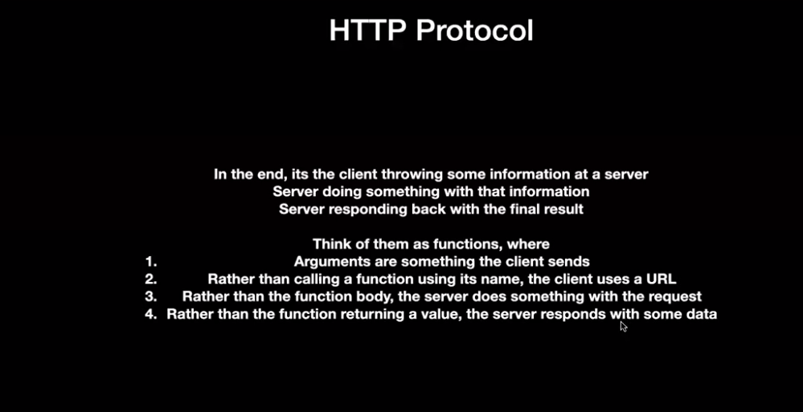
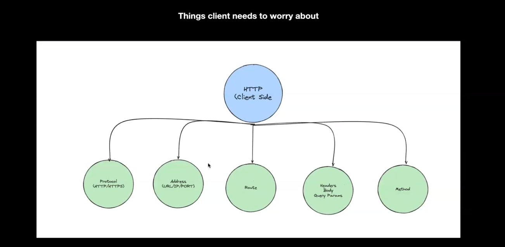
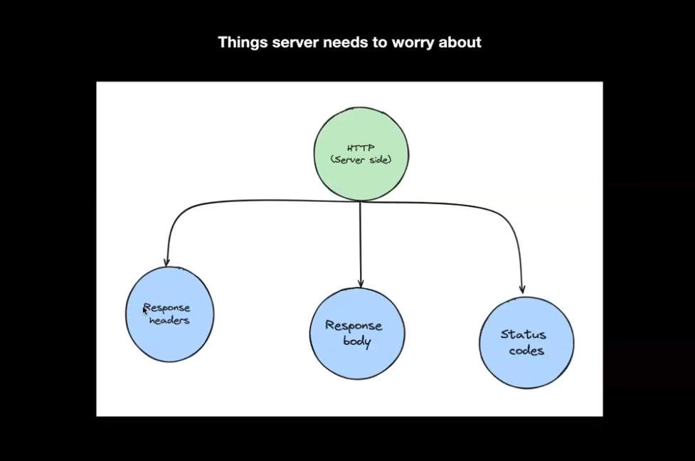
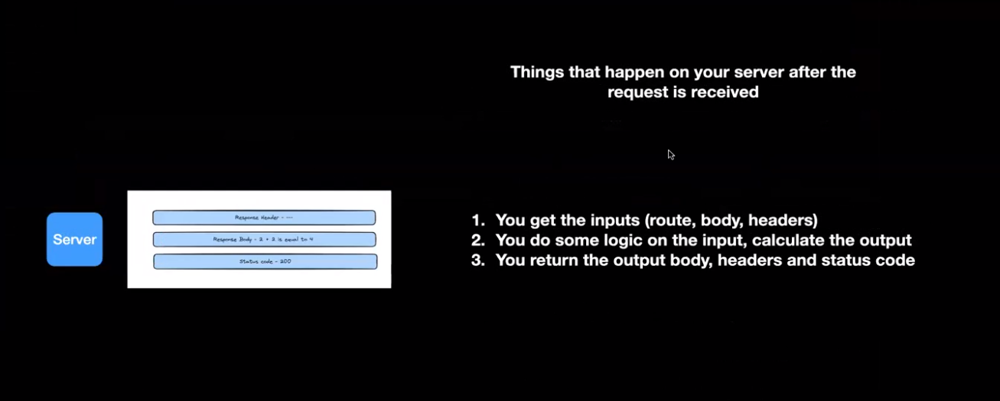
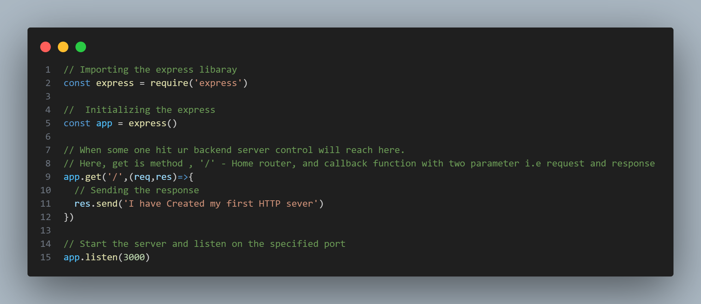
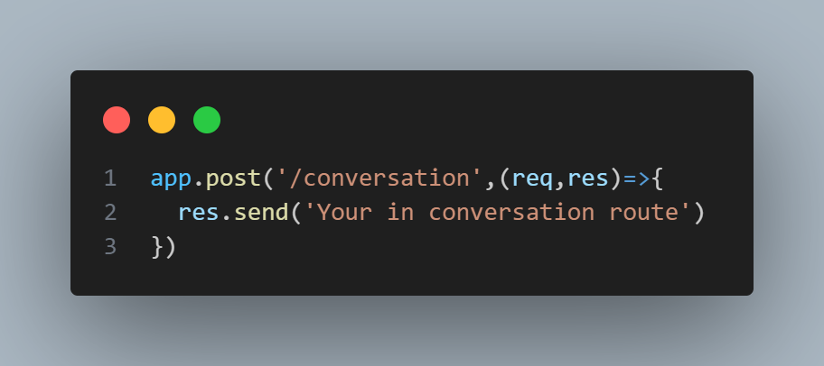
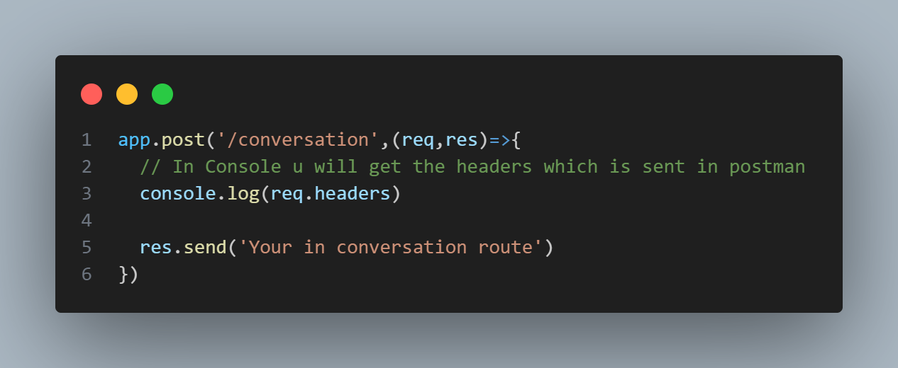

## Topics 

1. Node js 
2. Express Basic
3. Creating HTTP Server

Let's embark on a journey of understanding as we delve into the meanings of various terminologies together
1. What is ECMAScript?
2. What is Javascript?
3. What is Node.js?
4. Whai is Bun?

### 1 . ECMA Script 
* ECMA script is a scripting language specification on which javascript is based.
* Ecma international is in charge of standarizing ECMAScipt.
* It bascially says that whoever needs to write a compiler for javascript
they need to follow the ECMA script standard
* It serves as a guideline or rules for scripting language design.
* Our browers also keep on updating on new js standards that ECMA script introduce every year.

> [Website link](https://tc39.es/ecma262/#sec-numbers-and-dates) - It gives the specification on javascript

### 2 . Java Script
* Java script is a scripting language that conforms to the ECMAScript specification.
* Java script also define some additional features that is not supported by ECMA , like Document Object Model(DOM) manuplication, which is crucial for web developement but it is not included in the ECMA standards.
* Example : setTimeout , fs.readFile.


#### Some of the common JavaScript engines used by popular browsers:

> Note : These js engine do follow the ECMA    Script standard

1.  V8 (Google Chrome, Node.js) : 
* V8 is an open-source JavaScript engine developed by Google. It is responsible for compiling jscode into native machine code before executing it , which greatly improves the performance.
* Written in C
* > [v8 Github repository](https://github.com/v8/v8)


2. SpiderMonkey (Mozilla Firefox) : SpiderMonkey is the JavaScript engine used in Mozilla Firefox. It has been a part of Firefox since its early versions.
* Written in C,C++ and Rust
* >[SpiderMonkey](https://spidermonkey.dev/)

### 3. Node.js
* Node.js is  javaScript runtime environment that executes JavaScript code outside of a web browser
* Js initally used in browsers but later some some smart people took the V8 engine(i.e javascript engine) and added some Backend features (Filesystem reads) on the top to create a new runtime engine i.e Node.js.
* Written in C and C++

### 4. Bun
* It is competitor of node.js
* Written in Zig
* It is significaly faster than node.js
* > [Bun Github repository](https://github.com/oven-sh/bun)


### What can we do with Node.js??

1. Create clis(Command line Interface)
2. Create  a video player.
3. Create a game.
4. Create a HTTP Server.


### What is HTTP ?
* HTTP stands for Hyper Text Transfer Protocol
* A Protocal that is defined for Machine to communicate. Specifically for websites,it is the most common way for website frountend to talk to its backend.



* #####   Things client needs to worry when they want to send the request to the server 



1. Protocol(HTTP/HTTPS)
2. Address(URL/IP/PORT)
3. Route
4. Headers,Body,Query Parameter
5. Method


> In above image,

1. Protocol - HTTP.
2. URL (i.e Address) - Chart.openapi.com(chartgpt).
3. Route - backend-api/conversation.
- It help determine how incoming HTTP requests are processed and which part of the application should respond.
4. Headers - Mainly for Authentication
5. Body - It is the Request that is sent by user
Ex - User can ask any types of questions to chartgpt,That string(questions) are sent as body in json formate
6. Method - Common HTTP methods include GET (retrieve data), POST (submit data), PUT (update data), DELETE (delete data), etc.


* #####   Things Server takes care when it sends back the response



1. Response headers.
2. Response Body.
3. Status Code.


> In above image
1. Response headers - When a user Sigin it returns the cookies from the server to the client.
2. Response body - It is a response to the user question which is sent by server side.
3. Status Code - 200 (The request was successful.)

#### Brower-side : After sending the request


DNS - Domain Name System

* Its very difficult to remember the IP address of the website very time so we use their domain name to visit the particular website.
* When a user enters a domain name (e.g., www.example.com) into a web browser, the DNS system is responsible for translating this domain name into the corresponding IP address that points to the server hosting the website.

#### Server-side : After sending the request



### Common methods

1. GET (retrieve data) 
2. POST (submit data) 
3. PUT (update data)
4. DELETE (delete data)

### Common Status code

1. 200 -Everything is Ok.
2. 404 - Page/route not found.
3. 403 - Authentication issues
4. 500 - Internal server error.(Backend issues)

```
Question that we usuall get
1.Why do we need status codes? Why can't we just return in body something like success:true/false.
2. Why do we need so many types of request method ? Why can't it just work with one.
3. Why do we need headers/body/query params , why can't just one work?

- These are the standard Practices , you don't need all of it, but it is what it is mentioned in spec and hence it is good to follow  
```


### Express - It is external libraies to create a http server

Lets create Http server

1. First make sure u have node and vs code editor installed in ur machine.
2. create and open the folder
3. create a file called index.js
4. Open the terminal and ruun the following commands

> // for installing the npm package
 * npm init - y  
> // for installing the express
* npm i express 

5. Open your web browser and navigate to http://localhost:3000/. You should see the response "I have Created my first HTTP sever"

6. Command to run the index.js file - node index.js


- **Request (`req`):** Represents the incoming HTTP request from the client. Contains information about the request, such as parameters, headers, and body.
- **Response (`res`):** Represents the outgoing HTTP response to be sent back to the client. Allows you to send data, set headers, and more.

Here in the above example we know how to send  get request

And we can even send the post request by browers
> By the help of Postman
* Postman provides a user-friendly interface for making HTTP requests, inspecting responses, and managing APIs. Postman supports various HTTP methods, including GET, POST, PUT, DELETE, and more.




* Open Postman and navigate to http://localhost:3000/conversation and change the method to post in postman and run the file in vscode and in postman click on send button to see the response in console .
* Make sure u run the file , even after making the small changes in your file


### How can u send the data through the headers

> You can send the data through the headers in postman

Ex- Authorization



> In the console u will get the information on the headers that you have sent through the postman 


### How can u send the data through the Body

Yess!!!But first we need to install body parser
>  npm i body-parser

Body-parser -> It allows you to extract data from the body of an incoming request and parse it into a format that your application can use.

> You can send the data through the Body in postman


> Import Body parser,which allow to extract data from the body


> In the console u will get the information on the body that you have sent through the postman 


### How can u send the data through the Query

Query Parameters: These are key-value pairs appended to the end of a URL, typically after a question mark (?). For example, in the URL https://example.com/path?name=John&age=25, the query parameters are name=John and age=25.

> You can send the data through the Query in postman


>In the console u will get the Query that you have sent through the postman 


